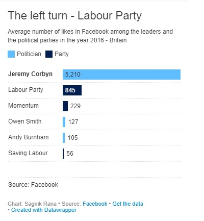

# Portfolio : Telling stories using data
This repository contains the collective work which is currently being performed in the course 'Telling Stories with Data'

# About Me
My name is Sagnik Rana and I am a graduate student at Carnegie Mellon University. I am enrolled under Business Intelligence Data Analytics program and currently working as Business Intelligence & Data Science Intern at [Gridwise](https://gridwise.io/). I like solving problems in business and my interest lies toward predictive modeling, centralizing data to evaluate KPIs and providing new leads toward the expansion of the business.  
I am quite passionate toward visualization and have used them thouroughly in the feature selection process in machine learning(in my work and classes). I hope to learn more about them in this course.

Apart from work and studies, I like playing pool, axe-throwing events, soccer and cricket(a game played by Asia, Australia, Europe, New Zealand and Carribean).

# What I hope to learn
I believe the ability to tell stories with data needs special skill. I am expecting to learn the art of delivering value through data, not just information. When we present visualizations, we generally deal with a large set of audiences. Most of the people are from difference culture and background. We cannot assume that everyone will be able to get the point through visualization right away. Many people suffer with [color blindness](http://www.colourblindawareness.org/colour-blindness/acquired-colour-vision-defects), which makes the color perception challenging for them. I expect to learn all these techniques in this course. 
I feel that visualization, more or less, is like google. The less time we spend in it to glean information, the more valuable it becomes.  I hope after taking this course, I will be able to take my visualization skills to one more step ahead. 
Here is the vizualisation for one of my projects, where I utilized 3-D cluster modelling to achieve best attributes in a model:
  

# Data critique - British Political situation:

In this assignment, we are critiquing this [article](https://github.com/sagnikrana/Portfolio-Telling-Stories-Using-Data/blob/master/The%20metamorphosis%20-%20The%20Labour%20Party%20.pdf1) where the current situation about british politics has been discussed. As per the good charts book, I have re-designed the graph and produced this graph [here](https://www.datawrapper.de/_/HVp6G/)
 

Improvements:
The main focus has been put over Jeremy Corbyn and how much importance he has over all major parties. My new diagram is small, which will allow it to appear in media(such as newspaper). The political parties are separated from the politicians which gives a good edge to the readers. The numbers are present, which will further help us to judge the metrics.
